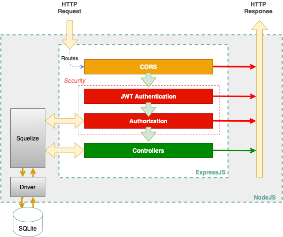
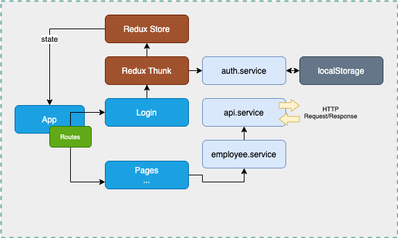

# Full Stack Developer Challenge

## Requirements

Design a web application that allows employees to submit feedback toward each other's performance review.

### Admin view

- Add/remove/update/view employees
- Add/update/view performance reviews
- Assign employees to participate in another employee's performance review

### Employee view

- List of performance reviews requiring feedback
- Submit feedback
<hr>

## High Level Design

### API server

Overview of ExpressJS API server:



HTTP request that matched a route will be check by CORS Middleware, then pass to Security layer.

Security layer includes JWT Authentication for verify user's token, and Authorization Middleware to check user's role in database.

If middlewares throw any errors, a message will be sent to client as HTTP response.

Controllers connect with database (SQLite), get data, execute logic code and send HTTP response to client depend on its request.

#### Technology

- [ExpressJS](https://github.com/expressjs/express)
- [Bcryptjs](https://github.com/dcodeIO/bcrypt.js)
- [Jsonwebtoken](https://github.com/auth0/node-jsonwebtoken)
- [Sequelize](https://github.com/sequelize/sequelize)
- SQLite, for quickly launch sample project and testing purpose.

### Web client



#### Technology

- [React](https://github.com/facebook/react)
- [react-redux](https://github.com/reduxjs/react-redux)
- [redux](https://github.com/reduxjs/redux)
- [redux-thunk](https://github.com/reduxjs/redux-thunk)
- [react-router-dom](https://github.com/ReactTraining/react-router/tree/master/packages/react-router-dom)
- [axios](https://github.com/axios/axios)
- [Bootstrap 4](https://github.com/twbs/bootstrap)

<hr>

## Installation

Clone this repository

```bash
git clone https://github.com/zyakita/FullStackEngineerChallenge.git
```

### API server

1. Change dir to `server` folder

```bash
cd server
```

2. Create .env file

- PORT: api server's port
- WEB_CLIENT_URL: full url to web client
- AUTH_SECRET_KEY: server use this value to sign & verify jwt token
- AUTH_TOKEN_EXPIRE: Expired time of single jwt token

```bash
cp .env.sample .env
```

3. Install dependancies

```bash
yarn install
```

4. Start app

```bash
yarn dev
```

### Web client

1. Change dir to `web` folder

```bash
cd web
```

2. Install dependancies

```bash
yarn install
```

3. Start app

```bash
yarn dev
```

<hr>

## Demo Data

In the `development` env, API server auto seeds some demo data for testing purpose.

Please use follwing credentials to login:

Administrator: admin@example.com / 123456

Employee:

user50@example.com / 123456

user49@example.com / 123456

user48@example.com / 123456 ... user2@example.com / 123456
